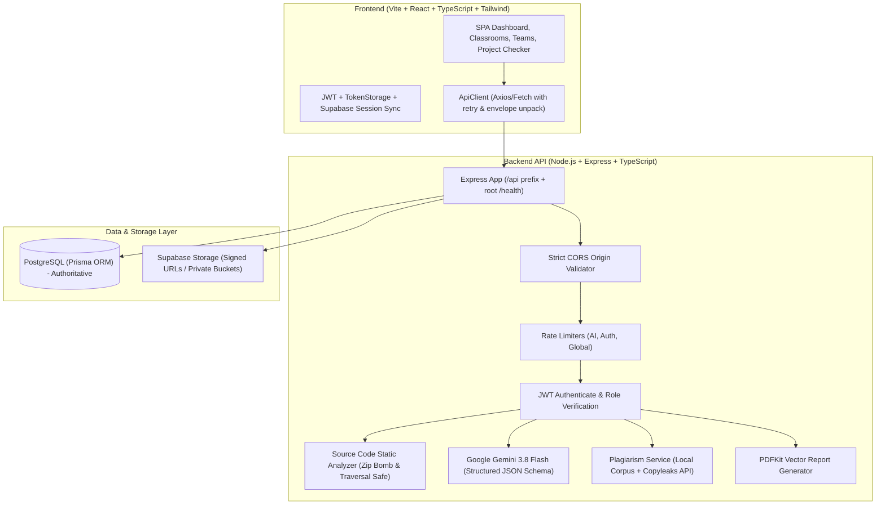

# PROVALIX-AI — Automated AI-Powered Academic Project Evaluation Platform

PROVALIX-AI is an enterprise-grade automated academic evaluation system that performs rigorous, multi-dimensional assessments of student engineering capstones, research submissions, and classroom projects.

It combines Google Gemini AI evaluation, deep language-agnostic source-code static analysis (handling ZIP archives and direct files), plagiarism scanning, classroom cohort workflows, team formation with permanent user IDs (`PRV-XXXXX`), faculty viva mark attribution, and dynamic PDF report generation.

---

## 1. System Architecture



---

## 2. Technology Stack

### Frontend
- **Framework**: React 18 with TypeScript
- **Bundler**: Vite
- **Styling**: TailwindCSS & Vanilla CSS design system tokens (Modern Light SaaS Aesthetic)
- **Icons**: Lucide React
- **Charts & Visualization**: Recharts (dynamic score distributions, category breakups)
- **Linter**: Oxlint & TypeScript compiler (`tsc --noEmit`)

### Backend
- **Runtime**: Node.js 20+ / TypeScript
- **Framework**: Express 4.21+
- **Security & Headers**: Helmet, CORS with strict environment origin checking
- **Rate Limiting**: `express-rate-limit` with custom windows for evaluation and auth
- **Database & ORM**: PostgreSQL via Prisma ORM (`@prisma/client`)
- **Authentication**: JWT (`jsonwebtoken`) with Access & Refresh token rotation
- **File Uploads**: Multer with in-memory magic-byte MIME type validation
- **Archive Extraction**: `adm-zip` in-memory parsing with zip bomb (max entries/uncompressed bytes) and path traversal (`..`, `\0`, `/`) defense
- **PDF Generation**: `pdfkit` dynamic multi-page vector PDF report generator
- **AI Engine**: Google GenAI SDK (`@google/genai`) using Gemini 3.8 Flash (`gemini-3.8-flash`) with structured schema validation
- **Test Suite**: Jest & Supertest

---

## 3. Core Modules & Capabilities

### 3.1 Project Checker (Standalone & Classroom)
- Standalone project submission with PDF report, presentation slides, and source code archive.
- Magic-byte file validation preventing executable masquerading (`.exe`, `.bat`, `.sh` rejected).
- Real language-agnostic source-code static inspection:
  - Lines of code (LOC), language breakdown, cyclomatic code smells, deep indentation warnings.
  - Test suite detection (`jest`, `pytest`, `unittest`).
  - Readme/documentation extraction and dependency manifest parsing.

### 3.2 100-Mark AI Evaluation Model
All evaluations follow an authoritative 100-mark rubric:
1. **Technical Architecture & Complexity** (25 marks)
2. **Implementation Quality & Code Robustness** (25 marks)
3. **Problem Solving & Innovation** (20 marks)
4. **Documentation & Methodology** (15 marks)
5. **Testing, Validation & Feasibility** (15 marks)

### 3.3 Dynamic PDF Reports (`GET /projects/:id/report/pdf`)
- Returns a downloadable vector PDF with `Content-Type: application/pdf`.
- Features header metadata, overall score badge, five-category breakdown table, strengths, weaknesses, plagiarism similarity percentages, and official verification stamps.

### 3.4 Classrooms & Evaluation Cohorts
- Cohort creation with join codes and role hierarchy: `OWNER`, `EVALUATOR`, `MEMBER`.
- Faculty evaluations with criteria scoring, viva marks attribution, verified status, and final grade publishing.
- Leaderboard ranking with privacy controls: students only access permitted project reports.

### 3.5 Teams & Squads
- Reusable squads across multiple classrooms.
- Team invitations via permanent User IDs (`PRV-XXXXX`).
- Captain controls: manage membership, transfer leadership, delete squad.

---

## 4. Plagiarism Detection Notice

> [!IMPORTANT]
> **Real Plagiarism Provider Configuration**:
> PROVALIX-AI comes with a local n-gram/TF-IDF text and code similarity engine for repository submissions.
> To enable external web and academic database plagiarism scanning, a commercial provider (such as Copyleaks or Winston AI) must be configured via environment variables:
> - `PLAGIARISM_PROVIDER=copyleaks`
> - `COPYLEAKS_API_KEY=<your_api_key>`
> - `COPYLEAKS_EMAIL=<your_email>`
>
> If these variables are omitted, PROVALIX-AI automatically operates in internal heuristic mode and clearly flags reports as evaluated against local cohorts rather than external academic databases.

---

## 5. Environment Configuration

### Backend (`backend/.env`)

```env
# Application Environment
NODE_ENV=development # development | test | production
PORT=5000
API_PREFIX=/api

# URLs & CORS
FRONTEND_URL=http://localhost:5173
BACKEND_URL=http://localhost:5000
CORS_ORIGIN=http://localhost:5173

# Database (PostgreSQL)
DATABASE_URL=postgresql://postgres:[PASSWORD]@[HOST]:5432/[DB]?sslmode=require

# Authentication Secrets (REQUIRED in production)
JWT_SECRET=your-secure-random-256-bit-jwt-secret
JWT_REFRESH_SECRET=your-secure-random-256-bit-refresh-secret
JWT_EXPIRES_IN=1h
JWT_REFRESH_EXPIRES_IN=7d

# Google Gemini AI
GEMINI_API_KEY=your-gemini-api-key
GEMINI_MODEL=gemini-3.8-flash

# Supabase (Storage & Auth Sync)
SUPABASE_URL=https://your-project.supabase.co
SUPABASE_ANON_KEY=your-supabase-anon-key
SUPABASE_SERVICE_ROLE_KEY=your-supabase-service-role-key
SUPABASE_STORAGE_BUCKET=provalix-uploads

# Plagiarism Provider (Optional External Provider)
PLAGIARISM_PROVIDER=local # local | copyleaks
COPYLEAKS_API_KEY=
COPYLEAKS_EMAIL=
```

### Frontend (`frontend/.env`)

```env
# API Base URL (must point to backend /api in production)
VITE_API_URL=http://localhost:5000/api

# Supabase Client
VITE_SUPABASE_URL=https://your-project.supabase.co
VITE_SUPABASE_ANON_KEY=your-supabase-anon-key
```

---

## 6. Local Setup & Installation

### Prerequisites
- Node.js 20+
- PostgreSQL database
- Google Gemini API key

### 1. Backend Setup
```bash
cd backend
npm install
npx prisma generate
# Copy and fill environment variables
cp .env.example .env
# Run database migrations
npx prisma migrate dev
# Seed initial roles and test data
npm run prisma:seed
# Start backend server
npm run dev
```

### 2. Frontend Setup
```bash
cd frontend
npm install
# Copy and configure environment variables
cp .env.example .env
# Start frontend development server
npm run dev
```

---

## 7. Testing & Quality Verification

Run all test suites and linter checks from the workspace root or respective directories:

### Backend Testing
```bash
cd backend
# Run all unit, integration, and security tests
npm test

# Run type check and linter
npm run lint

# Compile production bundle
npm run build
```

### Frontend Testing
```bash
cd frontend
# Run linter
npm run lint

# Build production bundle
npm run build
```

---

## 8. Health Checks & Deployment Readiness

### Health Check Endpoints
- **Root Health Check**: `GET /health` -> `{ "status": "ok", "timestamp": "..." }`
  - Designed for Render, AWS ALB, and Docker container health probes without exposing database or secret internals.
- **Detailed API Health Check**: `GET /api/health` -> Checks database connectivity and returns service status.

### Production Deployment Checklist
1. Set `NODE_ENV=production`.
2. Configure non-empty, strong random strings for `JWT_SECRET` and `JWT_REFRESH_SECRET`. Backend will intentionally refuse to start if missing in production.
3. Update `FRONTEND_URL` and `CORS_ORIGIN` to the deployed frontend domain (e.g. `https://provalix-ai.vercel.app`).
4. Set `VITE_API_URL` on Vercel to your deployed backend URL (e.g. `https://provalix-backend.onrender.com/api`).
5. Ensure Supabase storage bucket `provalix-uploads` is marked private with signed URL downloads enabled.
